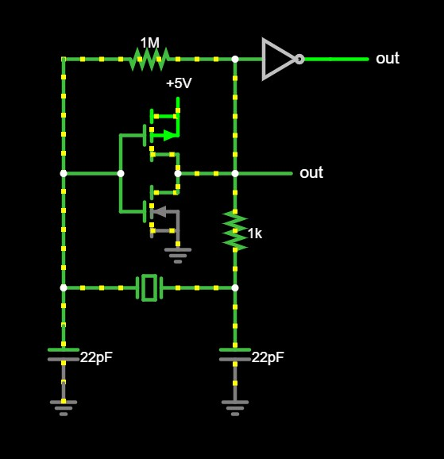

- [Build a Spy FM Transmitter with a Crystal - DIY Tutorial - YouTube](https://www.youtube.com/watch?v=xhnnIXVGLX8)
- [解析皮尔斯晶体振荡器的工作原理与起振条件-CSDN博客](https://blog.csdn.net/weixin_42005993/article/details/125955415)
- [晶振的等效电路模型_晶振等效电路-CSDN博客](https://blog.csdn.net/weixin_42005993/article/details/125955410)
- [晶振的构造及工作原理_32.768khz晶振电路-CSDN博客](https://blog.csdn.net/weixin_42005993/article/details/125345167)
